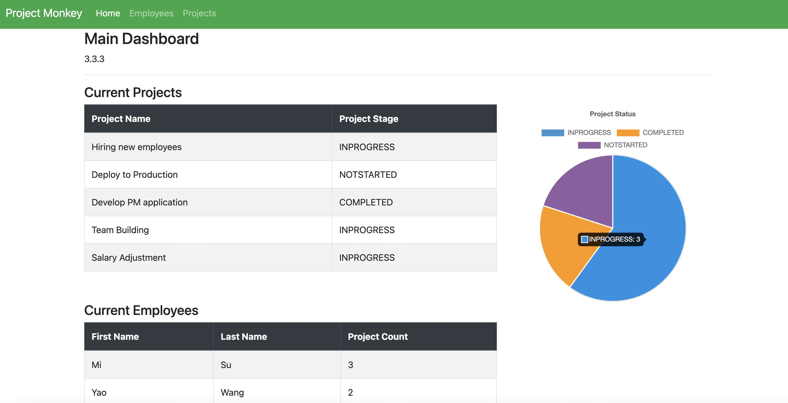

# Online-Project-Management-System-in-Spring
A project management web application to support project creating, updating, deleting (REST API, dependency injection, Thymeleaf etc.) and real data visualization (Chart.js, Google Chart). Facilitate project and employee management for PMs.
 
#### Applied tech: Spring boot, Hibernate, Spring security, Spring MVC, JDBA, RESTFUL API, AWS EC2 etc.
APP URL: http://ec2-18-117-126-53.us-east-2.compute.amazonaws.com:8080/

